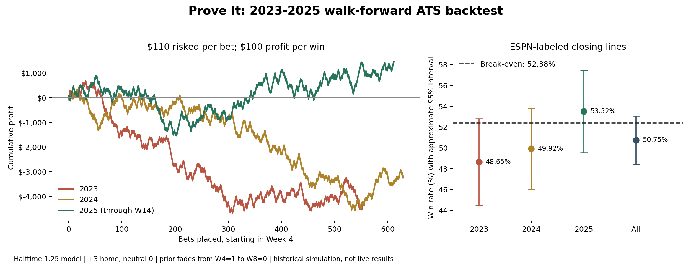

# Private Prove It backtest: 2023-2025

**The broad test does not reproduce a profitable 57% edge.** Using the production halftime model, ESPN-labeled closing handicaps, and hypothetical -110 prices, the result is 911-884 (50.75%), losing $6,140 on $197,450 risked (-3.11% ROI). No code, data, or results from this analysis were pushed or committed.

## Main result

| Season | W-L | Win rate | Profit | ROI | No-edge passes |
|---|---:|---:|---:|---:|---:|
| 2023 | 270-285 | 48.65% | -$4,350 | -7.13% | 14 |
| 2024 | 314-315 | 49.92% | -$3,250 | -4.70% | 32 |
| 2025 through Week 14 | 327-284 | 53.52% | +$1,460 | 2.17% | 17 |
| Total | 911-884 | 50.75% | -$6,140 | -3.11% | 63 |

There were 1,858 eligible model/closing-line matches out of 1,963 supplied completed FBS-involving games from Week 4 onward (94.7%). Of these, 63 had no edge at the displayed half-point precision and were passed. No pushes occurred in this particular line sample; the grading code handles pushes and refunds the stake. Maximum chronological drawdown across the main sample was $9,820.

The implied break-even rate at -110 is 110/210 = 52.38%. The approximate per-bet Wilson 95% interval is 48.44%-53.06%; games involving shared teams are not fully independent, so this is descriptive, not a definitive confidence guarantee. These results do not establish a betting edge.

## Exact rules

- Fresh ratings were fitted for all 47 betting periods. Regular weeks use the earliest kickoff among all supplied games in that week, not just the games with betting lines. Postseason games are grouped Monday-Sunday, with a new fit before the first kickoff in each group.
- Training includes only completed supplied games whose kickoff was more than 12 hours before that cutoff; games in the forecast period itself are excluded. This is a conservative completion buffer because the CSV has kickoff timestamps, not final-whistle timestamps. All training IDs, cutoffs, and ratings are saved.
- Bet from regular Week 4 onward; weights W4=1, W5=.75, W6=.5, W7=.25, W8 onward=0. Postseason prior is 0. The model does not use any bookmaker line when fitting ratings.
- Production halftime1.25 rule: cap final-margin credit at 28; when the eventual winner led by at least 21 at halftime and won by at least 10, allow the greater of capped-final credit and 1.25 times its halftime lead, with a maximum credit of 56. Add the production winner bonus of 2.75. Missing or inconsistent quarter scores use the capped-final rule.
- Forecast home margin = home rating minus away rating +3, or +0 at neutral sites. Rating fitting itself remains unchanged. Production display rounds stored two-decimal predictions to the nearest half point. Pick the side on which the model differs from the market; no edge means no bet.
- Each bet risks $110; wins earn $100, losses lose $110, pushes net $0. No confidence threshold, variable staking, parlaying, or optimization after seeing the results.
- 2023 prior: fit our cap28 model without a prior to 2022 results only. The 2022 schedule archive lacks quarters. 2024 and 2025 priors: prior season final halftime1.25 ratings, with zero prior weight. Teams are mapped by numeric ID across seasons. The original cap28 comparison uses identical priors to isolate the game-target change.
- All inputs and the production implementation are frozen locally with SHA-256 hashes. Final historical CSVs can contain later data corrections; historical as-published revisions are unavailable. The chosen model is retrospective, and 2025 was already used in earlier development, so it is not a pristine untouched holdout.

## Line provenance and limitations

Primary lines come from the ESPN core odds API, provider 58 (returned as ESPN BET), using the explicit home/away `close.pointSpread.american` pair. Example endpoint: https://sports.core.api.espn.com/v2/sports/football/leagues/college-football/events/401525853/competitions/401525853/odds . Full responses are cached under `data/odds/`. The selection uses a fixed provider, never whichever bookmaker makes the picks look best. Live-odds provider 59 is excluded.

Both team IDs must match the supplied home/away orientation. Five games with mismatched orientation were excluded, including bowls with conflicting home/neutral designations. Values must be finite, antisymmetric, on a half-point increment, and below 100 in magnitude: some 2023 close fields incorrectly contain American prices such as -115 instead of handicaps. They are not treated as valid closing lines.

These are API-labeled closing lines, not independently timestamped pre-kickoff tickets. Almost all are half-point handicaps, which explains the lack of pushes; many carry prices other than -110. The requested flat -110 assumption is therefore a hypothetical repricing, not evidence that every recorded handicap could actually have been bought at -110.

An independent public CFBD-derived archive corroborates 928/1155 overlapping lines within 0.5 points, and 1061/1155 within 1 point. It describes its `spread` column as a closing spread but does not identify a consistent bookmaker. It is used as a separate sensitivity check, not to pick favorable lines. Source: https://github.com/zachringnight/cfbmodel/blob/main/info_sheet_data.md . Large disagreements are saved for review in `results/crosscheck-summary.json`.

| Season | Explicit closing matches | Archived-current fallback | Excluded odds/identity issues |
|---|---:|---:|---:|
| 2023 | 569 | 69 | 18 |
| 2024 | 661 | 3 | 14 |
| 2025 | 628 | 0 | 1 |

## Robustness checks, without retuning

| Check | W-L | Win rate | Profit | ROI |
|---|---:|---:|---:|---:|
| Original cap28, identical priors | 896-870 | 50.74% | -$6,100 | -3.14% |
| Unrounded model picks: every matched game | 942-916 | 50.70% | -$6,560 | -3.21% |
| Include archived-current fallback lines | 938-925 | 50.35% | -$7,950 | -3.88% |
| Independent archive, 2023 subset | 271-277 | 49.45% | -$3,370 | -5.50% |
| Independent archive, 2024 subset | 281-278 | 50.27% | -$2,480 | -3.93% |

Unrounded picks address the literal bet-every-game interpretation and lead to the same overall conclusion. The independent archive covers a different subset, mainly Week 5 onward; its results are not directly comparable to the full primary seasons. No source was chosen because of its betting return.

## Descriptive follow-ups

| Group | W-L | Win rate | Profit | ROI |
|---|---:|---:|---:|---:|
| FBS vs FBS | 878-866 | 50.34% | -$7,460 | -3.89% |
| FBS vs lower division | 33-18 | 64.71% | +$1,320 | 23.53% |
| Weeks 4-7 | 288-289 | 49.91% | -$2,990 | -4.71% |
| Weeks 8+ regular season | 586-553 | 51.45% | -$2,230 | -1.78% |
| Weeks 11+ regular season | 342-305 | 52.86% | +$650 | 0.91% |

FBS/lower-division games and late-season games are plausible areas for a future preregistered test, but these smaller descriptive slices are not validated betting strategies. The overall strategy requested here loses money.

## Reproduction and audit files

From this folder: `python backtest.py`, `python -m unittest test_backtest -v`, then `python report.py`. Dependencies: numpy, requests, matplotlib. `fetch_historical_odds.py` downloads only public game-odds responses and reuses the cache; it does not upload model information.

- `results/game-by-game.csv`: every eligible fixture, line status, predictions, picks, result and profit.
- `results/weekly-ratings/`: all 47 fresh fits, both model variants.
- `results/weekly-audit.json`: exact training IDs, cutoff, prior weight, and quarter-score coverage.
- `results/prior-2023.csv` through `prior-2026.csv`: reproducible priors; the 2026 output is unused by this test.
- `results/weekly-explicitClose.csv`: weekly outcomes.
- `results/summary.json`: aggregate results, input/code hashes and policy.
- `results/score-quality.json`, `line-crosscheck.csv`, `crosscheck-summary.json`: data-quality evidence.
- `production_ratings.py`: frozen copy of the production code; no production files were changed.

2022 bootstrap schedule source: https://github.com/sportsdataverse/sportsdataverse-data/releases/tag/cfb_schedules . Initial betting archive discovery: https://github.com/sportsdataverse/sportsdataverse-data/releases/tag/espn_cfb_betting . Schema documentation: https://github.com/sportsdataverse/cfbfastR-cfb-data/blob/main/DATASETS.md . Supplied 2023/2024 exports are copied unchanged; 2025 is the existing `cfbweek15.csv` archive, with completed FBS games only through Week 14. No missing 2025 bowls were fabricated.

Six automated checks passed: grading including pushes; prior schedule; future-score perturbation leaves earlier fits unchanged; every saved temporal cutoff; profit accounting; and halftime credit/fallback behavior.
